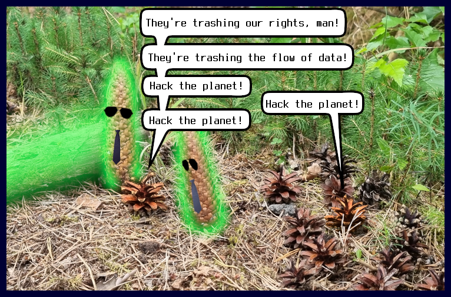

# Bootable and/or Runnable WebP Polyglot

This project pays homage to the [POC || GTFO](https://github.com/angea/pocorgtfo) polyglot formats. It creates a valid WebP image that can be booted on the x86 architecture or can be executed as a shell or Ruby script. It's a PoC by itself and is not meant to be used seriously.

A detailed description is available at the following links:

* [WebP Polyglot I: Bootable Picture](https://research.h4x.cz/html/2023/2023-08-08--webp_polyglot_i-bootable_picture.html)
* [WebP Polyglot II: Executable Picture](https://research.h4x.cz/html/2023/2023-09-01--webp_polyglot_ii-script.html)


# Build

```shell
gcc -Wall -I./ -std=gnu99 -O3 webp-polyglot.c -o webp-polyglot
```


# Usage

Show all RIFF chunks:
```shell
./webp-polyglot test_images/h4x_16x16-anim.webp
```

Embed MBR code into VP8L WebP image:
```shell
./webp-polyglot -s mbr/mbr.bin -c -o out.webp test_images/h4x_16x16-vp8l-lossless.webp
```

Embed Ruby code and multiple VP8L WebP images into one WebP image:
```shell
./webp-polyglot -S 20200000 -s test_scripts/script-ruby-equal.rb -p -1 $'\';\n' -C 203d2700 -c -o out.webp  img1-1025x1025.webp img2-1025x1025.webp
```

(For more details see the links in the introduction.)


# Examples



```shell
qemu-system-x86_64 -fda /a/down/out.webp
```

